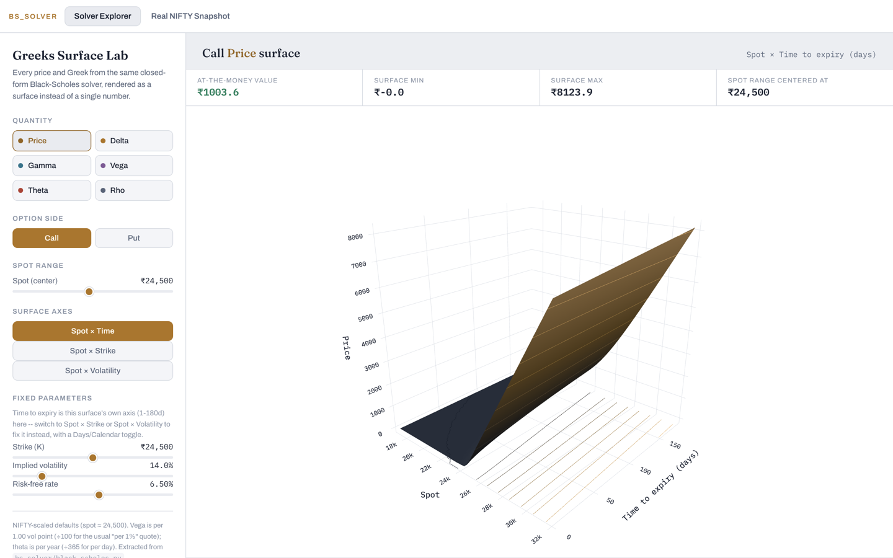
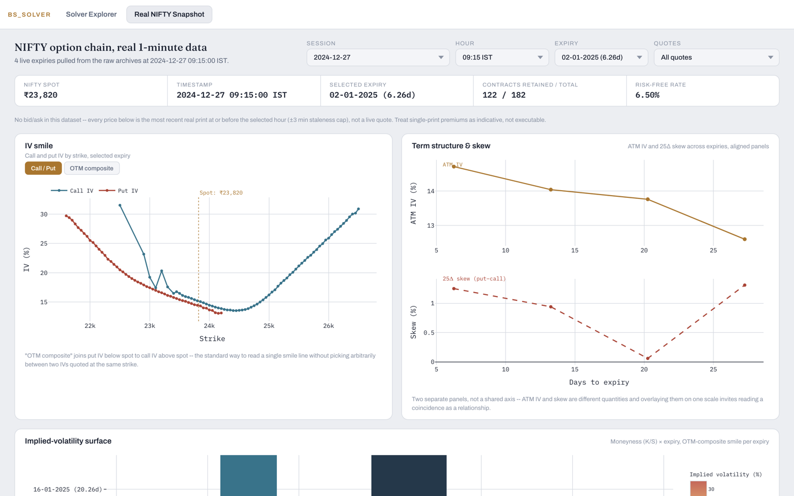

# Greeks Surface Lab

[](https://github.com/subbu-31/greeks-surface-lab/actions/workflows/ci.yml)
[](pyproject.toml)
[](pyproject.toml)
[](LICENSE)

A standalone, dependency-free Black-Scholes solver, a Greek-based P&L
attribution engine built on top of it, and two 3D-first ways to look at
the solver itself: a closed-form Greeks explorer you drive with sliders,
and a real NIFTY option-chain snapshot with an IV smile, term structure,
skew, Greeks-by-strike, and put-call-parity view.

Every formula is cross-checked against finite-difference derivatives of
the pricer itself (`tests/test_greeks_finite_diff.py`, all Greeks
including vanna/charm/volga agreeing to 10⁻⁴-10⁻¹¹), plus put-call parity
and an independent JS reimplementation used by the web page.

**Scope, stated plainly:** Black-Scholes pricing, the Greeks, and IV via
bisection are textbook, not novel. What this repo demonstrates is
process: real market data handled honestly (no bid/ask, disclosed
throughout), an attribution engine verified to reconcile exactly, and a
record of real bugs found and actually fixed.

**Solver Explorer** -- pick a quantity, an option side, and a pair of axes;
every surface is the closed-form solver evaluated live on a 46×46 grid.


**Real NIFTY Snapshot** -- real 1-minute option prints from an actual
trading session, IV backed out per strike, every chart linked to the same
Session/Hour/Expiry selection.


## Layout

- `bs_solver/black_scholes.py` -- price, implied vol (bisection), delta,
  gamma, vega, theta, rho, vanna, charm, volga. Stdlib only, `mypy --strict`
  clean.
- `bs_solver/attribution.py` -- decomposes a price change into eight Greek
  contributions plus a residual. `attribute_leg` does one option;
  `attribute_portfolio` sums a book held over the same period.
- `bs_solver/rates.py` -- `rf_rate(on)`, a date-aware risk-free rate
  verified against RBI/PIB press releases.
- `tests/` -- parity/boundary checks, finite-difference verification of
  every Greek, attribution reconciliation tests, a JS-vs-Python parity
  test (also checks `explorer.js`'s session data against the committed
  market JSON), and `rf_rate()` checked against every sourced decision date.
- `scripts/build_market_snapshot.py` -- prices a real option chain across
  several live expiries at **seven hourly checkpoints** (09:15-15:15 IST),
  each matched to the most recent real print within a 3-minute staleness
  cap. Needs `DL_DIR` pointing at a local archive to re-run; not needed to
  use the solver.
- `scripts/build_snapshot_series.py` -- six real strikes at a fixed
  intraday time across five consecutive real trading days, for the
  attribution demo's straddle/strangle/iron-condor.
- `scripts/attribute_pnl.py` -- runs the attribution engine over those
  five days for all three structures, reporting the thinnest volume behind
  each transition and a liquid-only recheck.
- `web/index.html` + `explorer.js` + `market.js` -- the two-tab page.
  `explorer.js` reimplements the Black-Scholes formulas in JS (checked by
  `tests/test_js_parity.py`); its Calendar-mode time-to-expiry picker uses
  the real dashboard's own Session/Hour/Expiry choices, not a free-form
  date picker. `market.js` drives every chart on the Real NIFTY Snapshot
  tab off linked Session/Hour/Expiry controls.

## Installing & reproducing

```
pip install .                    # solver + attribution engine, zero dependencies
pip install ".[snapshot-tools]"  # + pandas, needed only to rebuild web/data/*.json
pip install ".[dev]"             # + pytest, mypy -- what CI runs

pytest                                    # full suite (37 tests), <1 sec, no data needed
mypy                                      # strict type check
python3 scripts/attribute_pnl.py          # straddle/strangle/condor on 5 real days
python3 -m http.server 8000 -d web        # serve the page (fetch() needs http://, not file://)
```

Every number and chart here comes from either a closed-form formula or a
derived JSON file already committed at `web/data/*.json` -- the raw NIFTY
archives are not included (licensed, not redistributable) but aren't
needed to run the solver, tests, or web page, only to regenerate that
JSON from scratch. That needs `DL_DIR` pointing at a local archive copy
(overridable env var, defaults to `~/Desktop/nifty options data`, never a
literal committed to version control):

```
DL_DIR=/path/to/archives python3 scripts/build_market_snapshot.py --date 2024-12-27 --out web/data/market_snapshot.json
DL_DIR=/path/to/archives python3 scripts/build_market_snapshot.py --date 2026-03-11 --out web/data/market_snapshot_2026.json
DL_DIR=/path/to/archives python3 scripts/build_snapshot_series.py
```

## Real bugs found along the way

**Netting residuals across days hid a fake regression.** Adding vanna,
charm, and volga to the attribution engine and rolling up the 5-day
window with `sum(residual)/sum(actual)` made the straddle's "% explained"
swing from ~92% to ~64%, as if three more verified Greek terms made the
fit *worse*. They hadn't -- netting *signed* residuals across independent
days let one day's error cancel another's, so the ratio reflected
sign-cancellation luck, not fit quality (the real day-by-day fit had
modestly *improved*, ~93.1% to ~93.3%). Fixed by aggregating with
`sum(|residual_i|)/sum(|actual_i|)` instead, with a regression test
(`test_netting_signed_residuals_across_independent_periods_is_misleading`)
locking in the distinction from `attribute_portfolio`'s own (legitimate)
netting across simultaneous legs.

**The sample window couldn't reach a high-vega regime, for two real
reasons.** The far-OTM wings (originally ±300/±600 pts) had no real
volume until the final nine days of life (tightened to ±150/±300, checked
against real daily volume, not guessed). Separately, the ATM put had zero
trades in the literal 09:45:00 bar on five consecutive days despite
trading thousands of contracts that day -- an exact-timestamp requirement
was silently discarding them; replaced with "most recent print within a
3-minute staleness cap." Combined effect: the reachable window moved from
13.24d-7.24d to 14.24d-8.24d. A genuinely liquid 25-30 DTE window for this
6-leg structure likely doesn't exist in this instrument class at all --
checked directly, not assumed.

**rho had never once been exercised with a real rate change.**
`attribute_leg`'s `r1` defaults to `r0`, and nothing had ever called it
with a different value -- `rho_pnl` was structurally `0.0` everywhere,
dressed up as an "eight-Greek ladder." The primary week (Dec 2024-Jan
2025) genuinely has a flat 6.50% rate, so that's correct, not a gap -- but
an earlier snapshot (2025-06-02) had been using 6.50% when the real rate
was 6.00% (inside the window opened by the 2025-04-09 cut), which wasn't
cosmetic: one rejected strike on the 2025-06-12 expiry cleared the
no-arbitrage bound purely from correcting the rate. Added
`test_pure_rate_move_is_all_rho` and
`test_rho_pnl_has_the_right_sign_for_a_real_rate_cut` using the real,
dated cut magnitudes.

**`r` defaulted to a flat constant, right next to the lesson that should
have killed that.** Every pricing function in `black_scholes.py` defaulted
`r` to a module-level `RF = 0.065` -- a caller that forgot to pass a rate
got 6.50% forever, silently. Fixed by making `r` required and
keyword-only everywhere (`attribute_leg`'s analogous `r0` default got the
same treatment), verified byte-identical output before/after. A related
holdout, `build_snapshot_series.py`'s own local `RF = 0.065`, was switched
to `rf_rate(d)` per sampled day, with a check that would warn if a future,
wider window ever crossed a real rate change.

**The dashboard and attribution engine used to describe two unrelated
weeks** (2025-06-02 for one, the week around 2025-01-09 for the other,
five months apart, for no real reason). Unified onto 2024-12-27 -- the
attribution engine's own first real day -- so `20250109` now shows up as
one of the dashboard's own live expiries. Then a second, deliberately
different session was added six months later (`--date 2026-03-11`) as a
breadth check: NIFTY's weekly expiry moved from Thursday to Tuesday
partway through 2025 (confirmed against every 2025 archive filename, not
assumed), and 2024-12-27/2026-03-11 sit cleanly on opposite sides of that
real convention change.

**The hourly view started as a separate card, and that was the wrong
shape.** A first attempt added a fixed-strike side panel that revalued one
ATM contract every hour, disconnected from the Session/Expiry controls.
Replaced with a single **Hour** selector wired into the same state:
`build_market_snapshot.py` now prices the full chain at seven hourly
checkpoints, and every chart re-renders off whichever hour is selected.
One side effect: per-hour stats now genuinely move around across the day
(the primary session's median |parity residual| ranges ~8-31 points
depending on the hour) -- informative, not a bug, since this dataset never
has a firm quote to check parity against in the first place.

## What's real and what isn't

- **Solver Explorer** tab: purely synthetic -- every surface is the
  closed-form solver evaluated on a grid you configure.
- **Real NIFTY Snapshot** tab: real 1-minute option prices at the selected
  hour, IV backed out per strike. The dataset has **no bid/ask** -- every
  number is a last-traded print -- so "Liquid only" (≥50 lots) and
  "Parity-valid only" (±15 pt residual) filters are both available, and
  most strike pairs exceed the parity tolerance at every hour, which is
  the expected result of checking parity with no bid/ask, not a broken
  filter. Only 4 expiries were live each session, so the IV surface is a
  heatmap with missing cells left missing, not extrapolated. Neither
  session accounts for dividends/carry.
- **`scripts/attribute_pnl.py`**: every number is real -- real spot, real
  traded prices, real IVs, across five consecutive real days. Scope: six
  contracts through one expiry week, not a general accuracy claim. The
  three structures land in three different liquidity situations: the
  **straddle** (92.9% explained) leans on a 75-lot ATM put on *every*
  transition -- too thin throughout for a liquid-only recheck. The
  **strangle** (93.7%) has no thin transitions at all. The **iron condor**
  (92.8%) has one thin transition; excluding it moves the fit to 93.0%.
